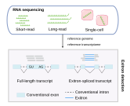

[](https://doi.org/10.5281/zenodo.15556565) [](https://doi.org/10.5281/zenodo.15724292) [](https://github.com/ylab-hi/ScanEPIC/actions/workflows/ci.yml) [](LICENSE "License")


# ScanEPIC


ScanEPIC (Scan **E**xitron **P**latform **I**ntegration **C**aller) is a bioinformatics tool for identifying and quantifying exitron splicing events across multiple RNA-seq platforms.

## Overview

Exitrons are novel intronic regions with both splice sites contained within a single annotated exon, effectively mimicking genomic deletions. ScanEPIC implements stringent filtering criteria to distinguish genuine exitron splicing events from technical artifacts such as those arising from reverse transcription slippage during library preparation.

Typical runtime is around ~10 minutes using 4 cores on an average sized RNA-seq experiment.


## Installation

### Prerequisites

- Python 3.9+ and a C compiler (ScanEPIC builds two small Cython extensions on install)
- Conda (recommended)
- [samtools / htslib](https://www.htslib.org/) (`bgzip`, `tabix`, `samtools`) for preparing input files

All Python dependencies (pysam, gffutils, Biopython, pandas, scipy, statsmodels, click and
[LIQA](https://github.com/WGLab/LIQA), which is used by the long-read module) are installed automatically by `pip`.

### Install from source

```bash
# Create conda environment
conda create -n scanepic -c conda-forge -c bioconda python=3.11 samtools htslib
conda activate scanepic

# Clone and install ScanEPIC
git clone https://github.com/ylab-hi/ScanEPIC.git
cd ScanEPIC
pip install .
```

### Development install

```bash
pip install -e ".[dev]"   # editable install + pytest + ruff
pytest                    # fast unit tests (no reference data needed)
ruff check src tests      # lint
```
## Input Requirements

### Required Files
- **BAM files**: Aligned RNA-seq reads with index (.bai)
- **Genome FASTA**: Reference genome sequence with index (.fai)
- **GTF annotation**: GENCODE-style gene annotation file (must be sorted, bgzip compressed and tabix indexed using [htslib](https://www.htslib.org/)). The `gffutils` package will create a database file (`<annotation>.gtf.gz.db`, next to the GTF) when ScanEPIC runs for the first time. This may take ~20 minutes for a full GENCODE annotation but will only need to be done once. Example of fully processed GTF file of GENCODE v37 can be found here [https://doi.org/10.5281/zenodo.15724292](https://doi.org/10.5281/zenodo.15724292).

ScanEPIC scans the chromosomes `chr1`-`chr22`, `chrX` and `chrY`, so the BAM, FASTA and GTF must use UCSC-style (`chr`-prefixed) chromosome names, e.g. hg38 + GENCODE.

### File Preparation
```bash

# If needed, sort your GTF annotation
awk '$1 ~ /^#/ {print $0;next} {print $0 | "sort -k1,1 -k4,4n -k5,5n"}' annotation.gtf > annotation.sorted.gtf

# Compress and index GTF file
bgzip annotation.sorted.gtf
tabix -p gff annotation.sorted.gtf.gz

# Index genome FASTA
samtools faidx genome.fa

# Index BAM file
samtools index input.bam
```

## Quick Start

### Test installation
```bash
scanepic --help
```

Every subcommand has its own `--help` listing all options and defaults, e.g. `scanepic extract short --help`.

### Short-read RNA-seq
```bash
scanepic extract short \
    -i input.bam \
    -g genome.fa \
    -r annotation.sorted.gtf.gz \
    -o output.exitron \
    --cores 4
```
Add `--vcf` to also write the exitrons as a VCF file (`output.exitron.vcf`).

### Long-read RNA-seq
```bash
scanepic extract long \
    -i input.bam \
    -g genome.fa \
    -r annotation.sorted.gtf.gz \
    -o output.exitron \
    --cores 4
```
Long reads must carry the minimap2 `ts` (transcript strand) tag; reads without it are skipped.
A temporary directory `scanexitron_tmp<PID>` is created in the current working directory while the tool runs and is removed when it finishes.

### Single-cell RNA-seq

**NOTE**: The scRNA module takes as input a list of BAM files in the following format:

| bam | sample_id | group |
|--------|-------------|-------------|
| sc_test_normal.bam | BT1293 | g1 | 
| sc_test_tumor.bam | BT1301 | g2 |

where the `bam` column is a path to the BAM file, relative to the directory containing the BAM list. `sample_id` will be used to identify sample names. The `group` column can be used for downstream analysis.

Also required is a TSV file with three columns which identify the cell barcode and its corresponding cell group:

| cells | sample_id | cell_group |
|--------|-------------|-------------|
| AACGGTACAAAAGC-1 | BT1249 | immune | 
| AACTCGGATCGCCT-1 | BT1301 | cancer |
| AAGAAGACACTGGT-1 | BT1300 | blood |

The header names (`bam`, `sample_id`, `group` and `cells`, `sample_id`, `cell_group`) must be used as shown. Make sure the columns `sample_id` in both files matches (i.e. cells from `sample_id` are found in the corresponding BAM file). For examples of these files, see `test_data` folder. Example command:

```bash
scanepic extract single \
    -i bam_list.tsv \
    -t cell_types.tsv \
    -g genome.fa \
    -r annotation.sorted.gtf.gz \
    -o output_directory \
    --cores 4
```


## Output Format

ScanEPIC produces tab-separated files containing:

| Column | Description |
|--------|-------------|
| chrom | Chromosome |
| start | Exitron start position |
| end | Exitron end position |
| name | Exitron identifier |
| region | Genomic region (CDS, 3'UTR, 5'UTR) |
| ao | Alternative observations (supporting reads) |
| strand | Strand orientation |
| gene_symbol | Gene symbol |
| length | Exitron length |
| splice_site | Splice site motif |
| transcript_id | Transcript identifier |
| pso | Percent spliced-out |
| dp | Read depth |
| alignment50 | Alignment quality score |
| rt_repeat | Longest repeated sequence shared by the two splice-site flanks (empty if none of length >= 4) |

The long-read module additionally reports `cluster_purity` (fraction of reads in the junction cluster supporting the reported coordinates) and `reads` (comma-separated IDs of supporting reads; realigned reads are prefixed with `REALIGNED_`). In long-read mode `transcript_id` holds the transcripts estimated by LIQA as `transcript,relative_abundance;...`, or `<annotated transcript>,NA` when LIQA could not assign the exitron reads. When `--id` is given, an extra `id` column is appended.

We recommend filtering out exitrons with `alignment50` score >= 0.7. Exitrons whose `rt_repeat` sequence is 6 nt or longer should also be filtered out unless working with direct RNA-seq data.

For scRNA-seq, ScanEPIC produces a folder with tab-separated files for each BAM file containing:

| Column | Description |
|--------|-------------|
| chrom | Chromosome |
| start | Exitron start position |
| end | Exitron end position |
| strand | Strand orientation |
| name | Exitron identifier |
| gene_symbol | Gene symbol |
| region | Genomic region (CDS, 3'UTR, 5'UTR) |
| splice_site | Splice site motif |
| length | Exitron length |
| alignment50 | Alignment quality score (exitrons >= `--alignment50` are already removed) |
| rt_repeat | Longest repeated sequence shared by the two splice-site flanks |
| read_total | Total number of reads supporting exitron across all cell types |
| cell_type | Cell type of called exitron|
| exitron_mols | Total number of unique molecules supporting the exitron (after deduplicating with UMI tags) |
| unique_mols | Total number of unique molecules at this locus |
| exitron_cells_not_found | Number of exitron-supporting molecules (UMIs) from cell barcodes not listed in the cell type input TSV, divided by the total number of exitron-supporting reads |
| pso | PSO of exitron in `cell_type` (exitron_mols/(unique_mols)) |
| pairwise_z_test_pvals | Comma separated p-values for each cell type, using z-test to compare each PSO pairwise |
| meta_pval | Fisher meta-p-value of `pairwise_z_test_pvals`. Good for first glance detection of exitrons that may be dysregulated across cell types|

An `id` column is appended when `--id` is given.

ScanEPIC in scRNA mode also outputs a splicing summary file `exitron_splicing_summary.tsv`. For each exitron detected in any sample, this file extracts the spliced and non-spliced molecule counts in each sample. This is useful for downstream differential expression analysis (see manuscript). 

Currently, ScanEPIC requires reads have the `CB` and `UB` tags which are generated
with the usual scRNA alignment pipelines.

### Converting to VCF

Any exitron table from `extract short` or `extract long` can be converted to VCF; exitrons are written as deletions (`SVTYPE=DEL`):

```bash
scanepic tools exitron2vcf -i output.exitron -g genome.fa -o output.vcf --compress --index
```

## Test Data

ScanEPIC includes test datasets to verify installation and demonstrate usage. You can download GENCODE v37 annotations that were processed by the instructions above here: [https://doi.org/10.5281/zenodo.15724292](https://doi.org/10.5281/zenodo.15724292). You will also need the hg38 genome FASTA (`hg38.fa`, indexed with `samtools faidx`).

Run the commands below from the repository root. Each test takes a few seconds once the annotation database has been built (the first run builds `gencode.v37.annotation.sorted.gtf.gz.db`, which takes ~20 minutes).

### Short-read RNA-seq Test
```bash
scanepic extract short \
    -i test_data/test_data.bam \
    -g hg38.fa \
    -r gencode.v37.annotation.sorted.gtf.gz \
    -o test_output_short.exitron \
    --cores 4
```

### Long-read RNA-seq Test
```bash
scanepic extract long \
    -i test_data/long_test_data.bam \
    -g hg38.fa \
    -r gencode.v37.annotation.sorted.gtf.gz \
    -o test_output_long.exitron \
    --cores 4
```

### Single-cell RNA-seq Test
```bash
scanepic extract single \
    -i test_data/sc_test_bam_list.txt \
    -t test_data/sc_test_cell_types.tsv \
    -g hg38.fa \
    -r gencode.v37.annotation.sorted.gtf.gz \
    -o test_output_sc \
    --cores 4
```

### Expected output

Expected results generated with GENCODE v37 are included for comparison:

| Test | Expected output |
|------|-----------------|
| Short-read | `test_data/test_data.exitron` (and `test_data/test_data.exitron.vcf` from `scanepic tools exitron2vcf`) |
| Long-read | `test_data/long_test_data.exitron` (generated by an earlier version; it lacks the newer `cluster_purity` and `reads` columns) |
| Single-cell | `test_data/sc_test_out/` |

Using a different GENCODE release can change the reported `transcript_id` values.


## Citation

If you use ScanEPIC in your research, please cite:

> Fry J, Liu Q, Lu X, et al. 3'UTR exitron splicing reshapes the 3' regulatory landscape in cancer. *Manuscript in preparation.*

## License

This project is licensed under the MIT License - see the LICENSE file for details.


## Support

For questions, issues, or feature requests:
- Open an issue on GitHub
- Contact: joshua.fry@northwestern.edu
